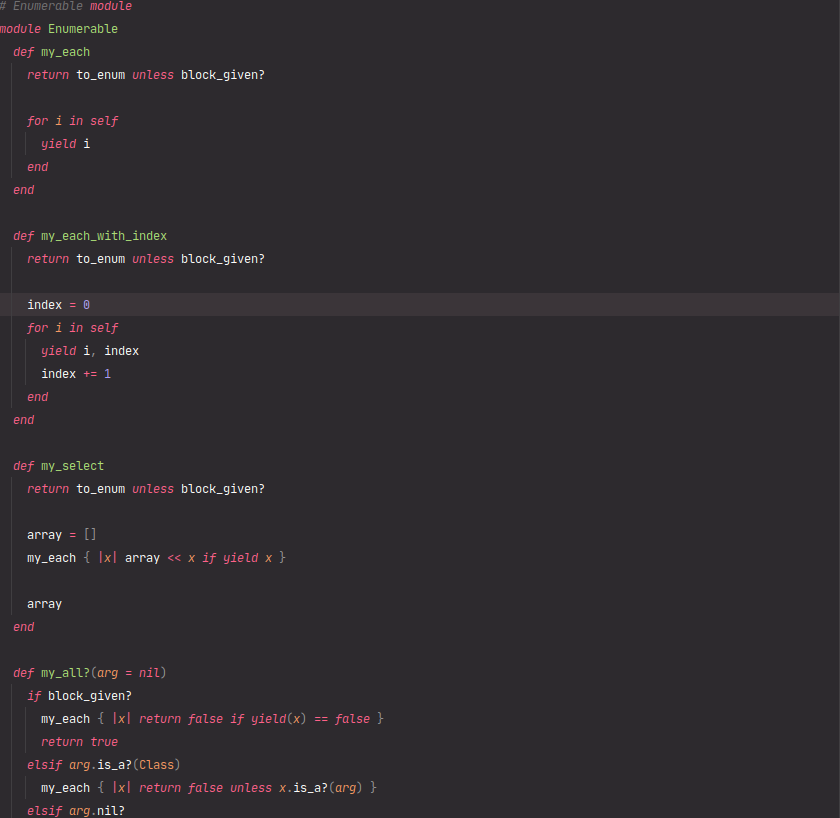

# Enumerable



> This is a script file to house our enumerable methods using the Ruby programming language.

## Live Demo
[Live Demo Link](https://repl.it/@Sanadwj/FumblingSizzlingParameter#main.rb)

## Built With

- Ruby -v2.7.0p0


## Getting Started

To get a local copy up and running follow these simple example steps.

- Go to the main page of te repo.
- Press the "Code" button and get the repo link.
- Clone it using git.

### Prerequisites

- Ruby -v2.7.0p0


### Setup
 - Open a terminal
 - Copy this code : 
        ```
        git clone https://github.com/sanadwj/enumerables.git
        ```
- Run the program with this code :
        ```
        ruby enumerable.rb
        ```

### Usage

- Personal Project - Create a script file to house our methods using Ruby in the best approach in our opinion . 

## Authors

👤 **Cecilia Benitez**

- Github: [@Ceci007](https://github.com/Ceci007)
- LinkenIn:[LinkenIn](https://www.linkedin.com/in/cecilia-ben%C3%ADtez-casaccia-498669185/) 

👤 **Sanad Walid Abujbara**

- Github: [@sanadwj](https://github.com/githubhandle)
- Twitter: [@sandooog](https://twitter.com/sandooog)
- Linkedin: [sanad-abujbara](https://linkedin.com/in/sanad-abujbara)

## 🤝 Contributing

Contributions, issues and feature requests are welcome!


## Show your support

Give a ⭐️ if you like this project!

## Acknowledgments

- Microverse Team 137 (The Vulcans)
- Microverse Team 139 (The Thanatos)

## 📝 License

This project is [MIT](lic.url) licensed.
